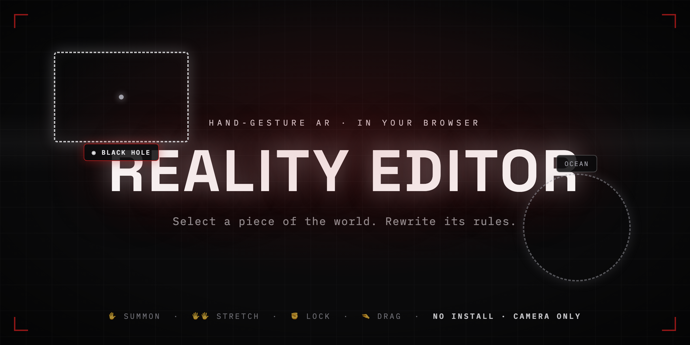
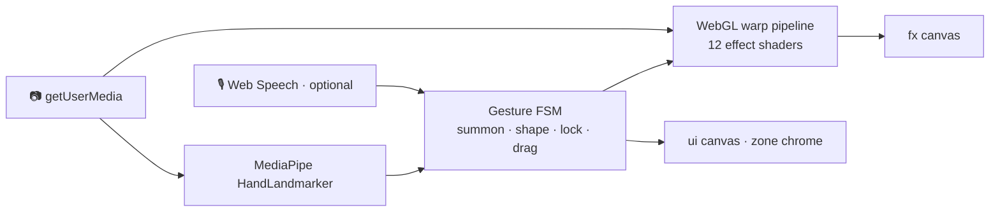

<h1 align="center">🪄 REALITY EDITOR</h1>

<h4 align="center">Select a piece of the world. Rewrite its rules.</h4>

<p align="center">
Hand-gesture AR that runs entirely in your browser — frame a zone with your hands<br/>
and turn it into a black hole, an ocean, frozen time, molten lava…<br/>
<b>No install. No account. Nothing recorded or uploaded.</b>
</p>

<p align="center">
  <a href="https://zakriaz.github.io/reality-editor/"></a>
  
  
  
</p>

<p align="center">
  <a href="#-powers">Powers</a> •
  <a href="#-gestures">Gestures</a> •
  <a href="#-run-it">Run it</a> •
  <a href="#-how-it-works">How it works</a> •
  <a href="#-development">Development</a>
</p>

<p align="center">
  <a href="https://zakriaz.github.io/reality-editor/"></a>
</p>

---

## ✨ Powers

Twelve reality transforms, applied live inside the zone you frame — **GRAVITY OFF**, **FREEZE TIME**, **SPACE TWIST**, **BLACK HOLE**, **OCEAN**, **NEON CITY**, **LAVA**, **PIXEL**, **VOID**, **THERMAL**, **HOLOGRAM** — switchable by tapping a chip or by voice: *"make this underwater"*, *"freeze time"*, *"black hole"*, *"clear"*.

## 🖐 Gestures

| Gesture | Action |
|---|---|
| ✋ Raise an open hand | A zone appears around your palm and follows it |
| 🖐🖐 Both hands | Stretch a panel wide between your palms |
| ✊ Snap a fist (or 🤏 pinch) | Lock the zone onto reality |
| 🤏 Pinch inside | Drag the zone around |
| 🤏🤏 Two-hand pinch | Scale + rotate |
| 🖐 Palm hold | Summon a new zone |
| ✊ Fist hold | Erase |

## 🚀 Run it

**Live demo:** **[zakriaz.github.io/reality-editor](https://zakriaz.github.io/reality-editor/)** — allow the camera, raise a hand.

**Single file:** download [`Reality Editor - Standalone.html`](./Reality%20Editor%20-%20Standalone.html) and double-click it. React, the engine, and the runtime are all inlined — only the MediaPipe hand-tracker model loads from a CDN.

**Local dev server:**

```bash
python3 -m http.server 8899
# open http://localhost:8899/Reality%20Editor.dc.html
```

## 🧠 How it works



Hand tracking runs locally in the browser via MediaPipe Tasks Vision; a finite-state machine turns landmarks into summon/shape/lock/drag/erase intents; a WebGL fragment-shader pipeline warps the live camera feed inside the selected zone (with a 2D-canvas fallback). Voice is optional Web Speech — nothing ever leaves the machine.

## 🛠 Development

| File | Role |
|---|---|
| [`engine.js`](./engine.js) | Core: camera, hand tracking, gesture FSM, WebGL effects, voice |
| [`Reality Editor.dc.html`](./Reality%20Editor.dc.html) | UI component (template + logic) |
| [`support.js`](./support.js) | Component runtime (generated — don't edit) |
| [`build-standalone.py`](./build-standalone.py) | Bundles everything into the single-file standalone |
| [`docs/index.html`](./docs/index.html) | The standalone, deployed to GitHub Pages |
| [`original/`](./original) | Pre-tweak snapshot of the imported design |
| `index.html`, `css/`, `js/` | Earlier prototype, kept for reference |

Rebuild the standalone after touching the engine or UI:

```bash
python3 build-standalone.py && cp "Reality Editor - Standalone.html" docs/index.html
```

---

<p align="center"><sub>Built by <a href="https://github.com/ZAKRIAZ">Zakariae Belfkih</a> · <a href="https://x.com/7_akaria">@7_akaria</a> · MIT</sub></p>
